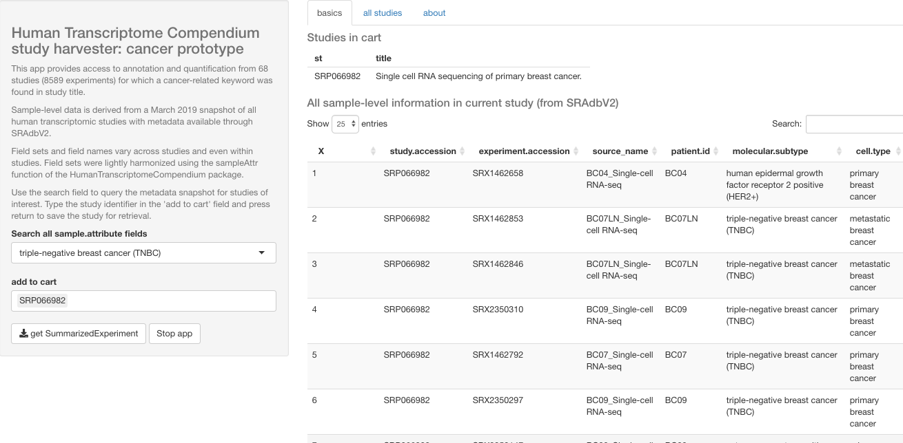

# htxapp

Explore human transcriptome compendium with focus on heterogeneous metadata

View of [vjcitn.shinyapps.io/cancer9k](https://vjcitn.shinyapps.io/cancer9k):

This is a prototype of an application that supports search over 
all available metadata on 
samples present in the htxcomp RNA-seq compendium developed by Sean Davis of NCI,
and return a SummarizedExperiment amalgamating selected studies, with
study-specific sample attribute data bound into the metadata component.

The prototype focuses on 58 cancer-related studies.  
